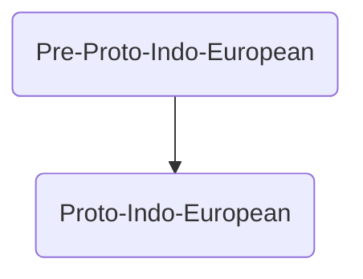

# lang-treemod-map.github.io
visualized map of language families based on the tree model

Here is a test flow chart:

```mermaid
graph TD;
    id1(Pre-Proto-Indo-European);
    id2(Proto-Indo-European);
    id1-->id2;

   
```
